参考

nosvelte
Apache License
Version 2.0, January 2004

https://github.com/akiomik/nosvelte

## 特徴

- kind:10000 の Mute、kind:30007 の Mute by kind に対応
- kind:10030 custom emoji に対応
- 通信量が気になる方のための、画像を表示しない、のモード

  - nip05 のチェックをしない
  - アイコンを表示しない

    npub をもとに生成した boring avatar ( https://github.com/boringdesigners/boring-avatars )を表示

  - OGP を取得しない
  - カスタム絵文字を表示しない

    short code で表示

  - metadata を更新しない

    メタデータはフォロー分だけキャッシュしてます

- NIP-19入りの記事（kind:30023）も割とちゃんと見れる

- petname📛がつけれる

## 各種設定

### リレー設定

- 各クライアント標準の kind:10002 を使うモード、アプリ固有のリレーを設定するモード (外のす用を固有に設定して外に出るときはそっちに切り替えて使う など)

### リアクション設定

- デフォルトのリアクションを設定できる

### 表示設定

- 画像を表示 ON/OFF

  - ON では、アイコンを表示する、カスタム絵文字、画像、OGP を表示する、nip05 の認証確認するメタデータの更新をチェックする。

- ノート作成時のプレビューの ON/OFF

  - 画像表示 ON のときだけ

- menu ボタンの位置 右下/左下

- 各ノートのユーザーアイコンの下にどのリレーから受信したのかを表示する ON/OFF

- 自分へのリアクションを TL に流す ON/OFF

- userStatus を表示する ON/OFF ( kind: 30315 identifier: general, music )

### データの同期

- mute (kind:10000)

- mute by kind (kind:30007)

- emoji (kind:10030)

更新頻度が多くなさそうなデータは手動で同期を行う。

取得したデータが確認できるので、データの反映状況が確認できる。

### メインメニュー

- home
- notifications
- search

  kind:10007 search relays から取得

  kind:10007が存在しない場合は nip50 に対応した３つのリレーから結果を取得

- global

  kind:30002 relay sets の dtag が Global のリレーリストから取得

- chat

  kind:10005 public chats を表示

- list

  kind:30000 people sets を表示

- settings

- edit ststus ( kind: 30315 の identifier: general )

- profile

  login user のユーザーページに移動

  ユーザーページでは、

  - ポスト
  - リアクション
  - フォローリスト
  - ブックマーク（ kind:10003 のみ）
  - リレーリスト ( kind:10002 )

    - Nip11 の情報が閲覧可能

    - 対応 NIPs はクリックすると該当する NIP のページに移動できる。

    - nostr.watch で開く
    - Nostrrr で開く

  が閲覧できる

#### キーボードショートカット

- n キーで ノート入力画面を開く

- ノート入力画面で
  - Ctrl+Enter キー で投稿
  - Esc キー( 多分 2 回入力くらい) で入力画面を閉じる

### 他

- /relay/[relayURL] でそのリレーのTLがみれる

  e.g. https://lumilumi.vercel.app/relay/catstrr.swarmstr.com

- 翻訳機能
- ブロードキャスト機能
- ZAP

など

----
- clienttag link : [nostrapp.link](https://nostrapp.link/)
- pin link: [nostviewstr](https://nostviewstr.vercel.app/)
- note link: [njump.me](https://njump.me/)
- translate: [google translate](https://translate.google.com/)
- relay link: [nostr watch](https://legacy.nostr.watch/)<!--[Nostrrr](https://nostrrr.com/), -->
- emoji link: [emojito](https://emojito.meme/)

------
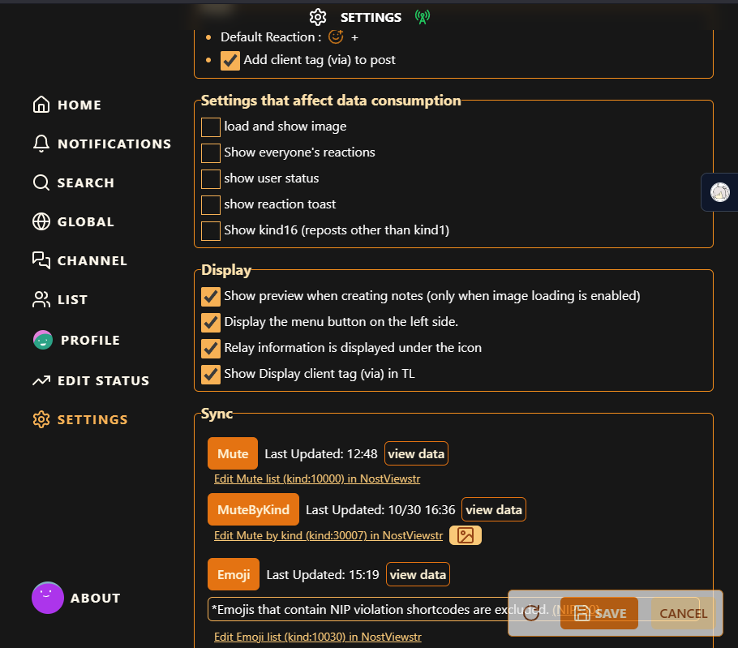
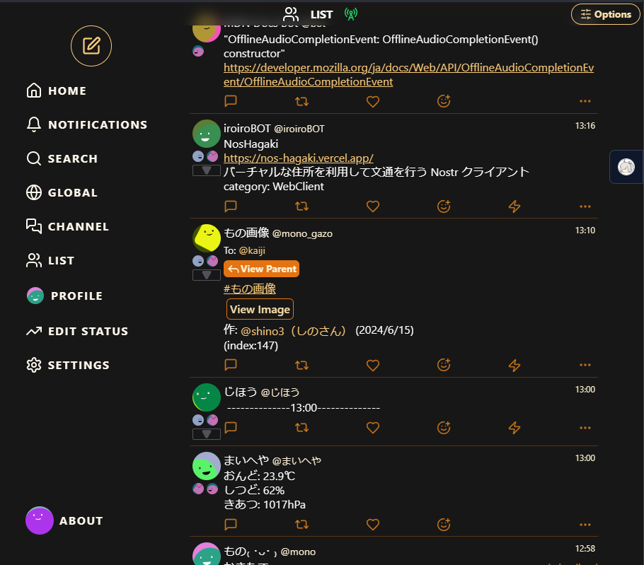
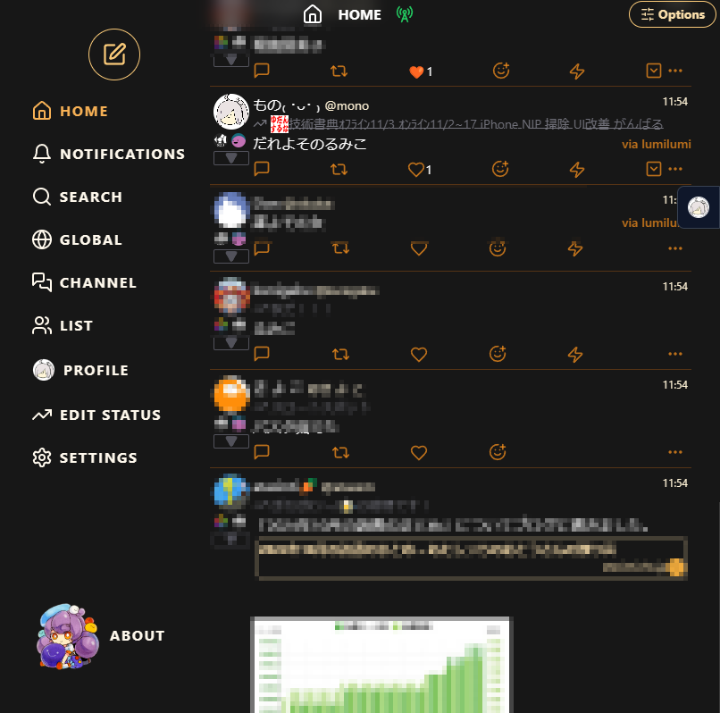
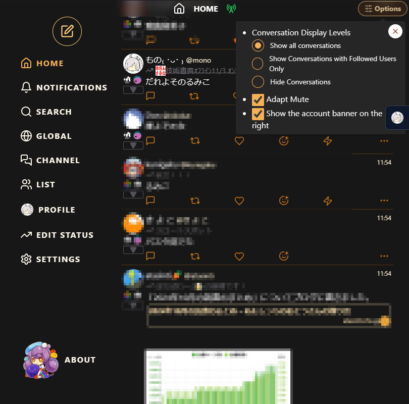
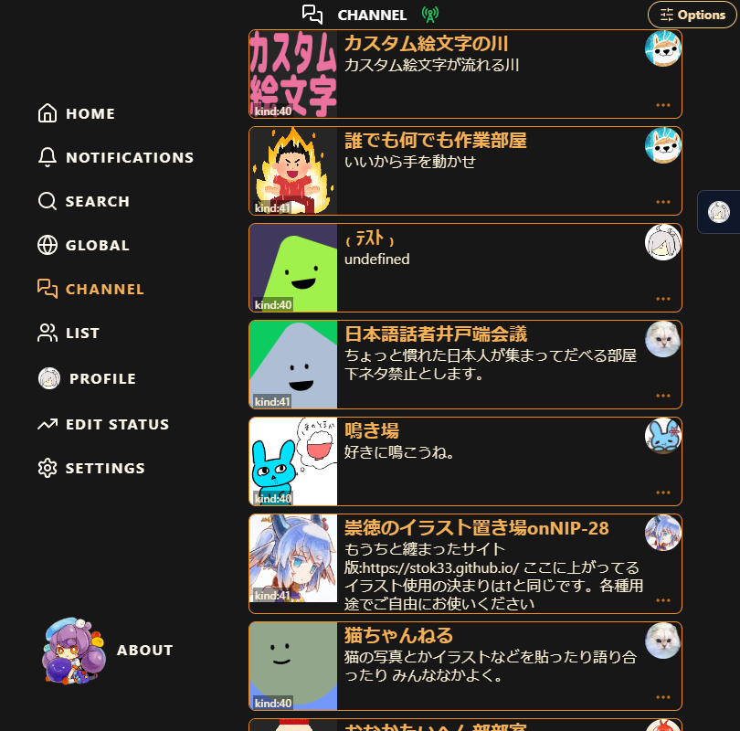
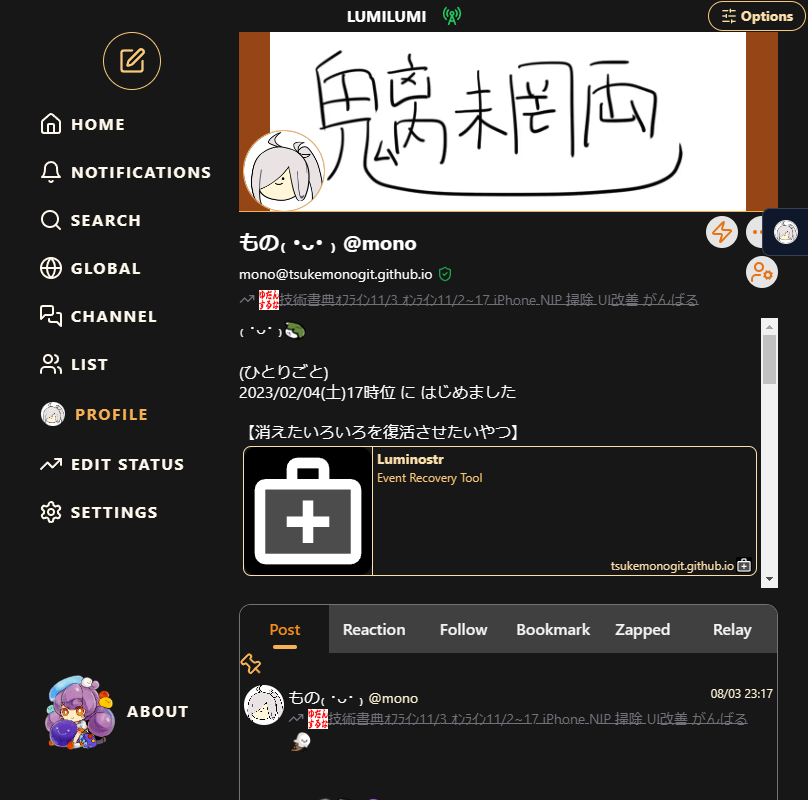
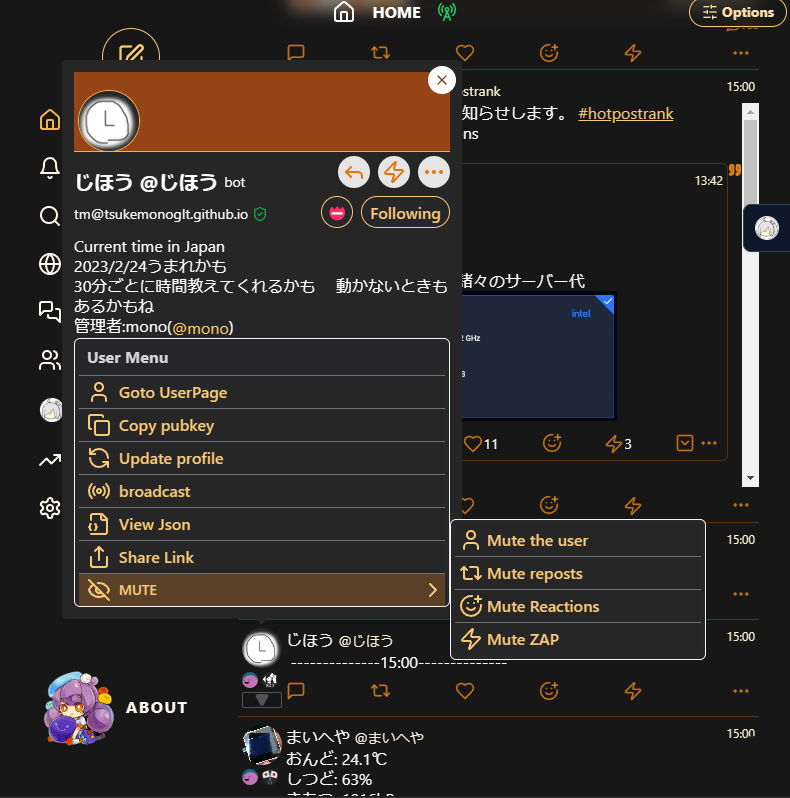
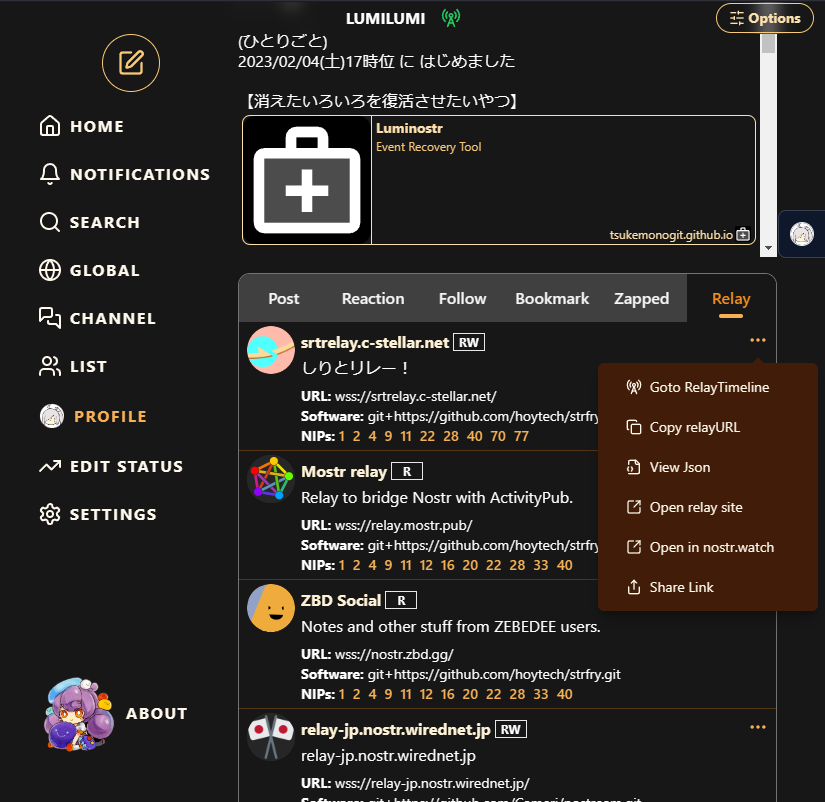
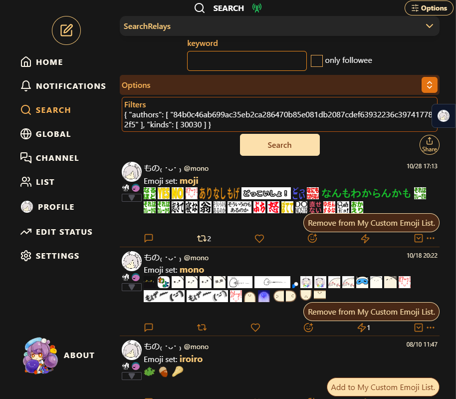
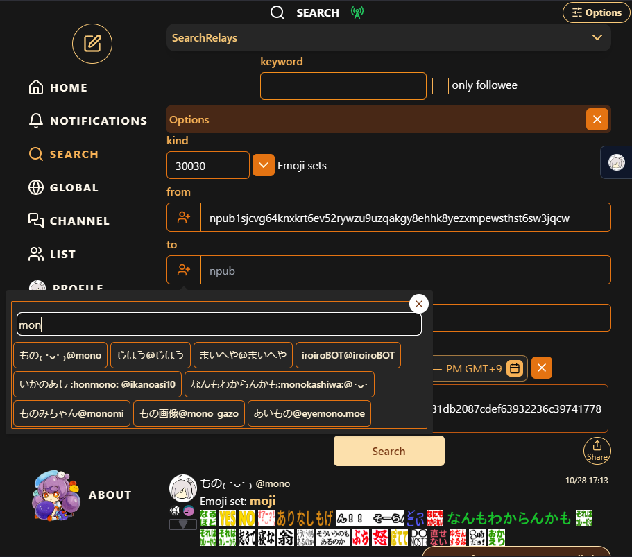
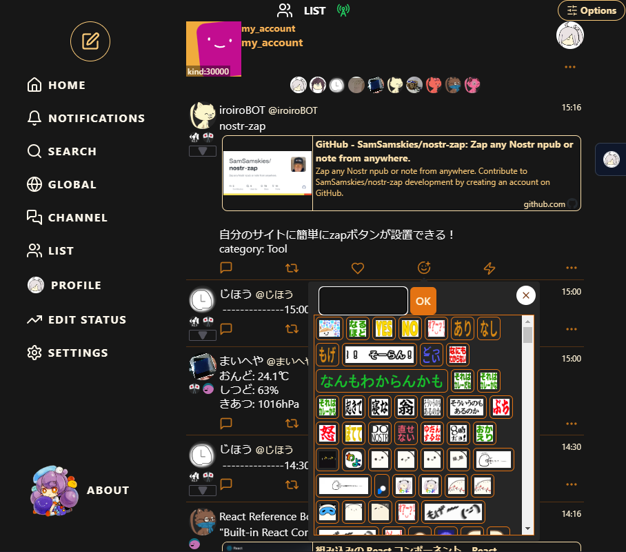
