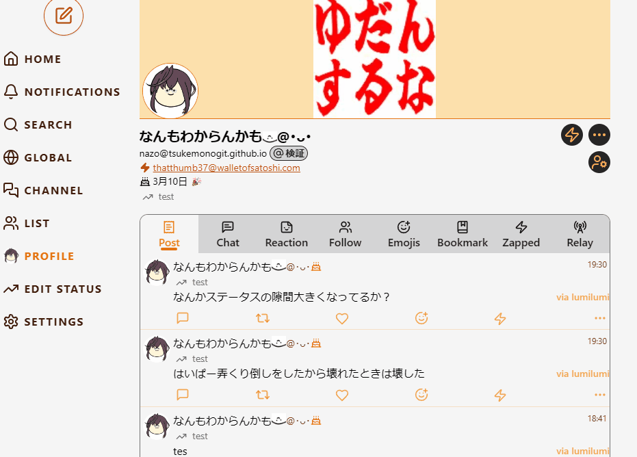

EN / [JA](./README-ja.md)

# Lumilumi - Nostr Web Client

## Key Features

### Voting Feature

Implemented voting functionality supporting [NIP-56](https://github.com/nostr-protocol/nips/blob/master/56.md). Users can vote from multiple options and check results in real-time.

### Image & URL Sharing

- You'll need to install Edge for Windows or Chrome for Android, otherwise it might not appear in the share menu
- While you can't use extensions on Android Chrome, you can easily use NIP-46 by installing [Amber](https://github.com/greenart7c3/Amber)

### Warning Content Blur Slider

### Birthday Feature

A special birthday animation plays, and a cake 🎂 appears next to the name (animation may be subject to change)

### 3D View

[Actual page](https://lumilumi.app/nevent1qvzqqqqqqypzq4jsz7zew5j7jr4pdfxh483nwq9vyw9ph6wm706sjwrzj2we58nqqyxhwumn8ghj77tpvf6jumt9qywhwumn8ghj7un9d3shjtnwdaehgu3wwa5hyetydejhgtn2wqqjqamnwvaz7tmjv4kxz7fddfczumn0wd68ytnhd9ex2erwv46zu6nsqyxhwumn8ghj7mn0wvhxcmmvqqsgn5eef652pzj07a2c0adfcazr23exkuhl09nldms9qv9cr4xvr3qk57wkh)

### Image-Off Mode for Data Saving

In image-off mode, we display a [boring avatar](https://github.com/boringdesigners/boring-avatars) generated based on npub as the icon to reduce data usage

### Article Viewing

[NIP-23](https://github.com/nostr-protocol/nips/blob/master/23.md) (kind:30023) articles can also be viewed

### Petname Support 📛

Add petnames based on [NIP-02](https://github.com/nostr-protocol/nips/blob/master/02.md)

### Geohash Location

## Configuration Options

### Relay Settings

- Mode using standard kind:10002 for each client
- Mode for setting app-specific relays (for example, configure for outdoor use and switch when going out)

### Post Settings

### Display Settings

### Data Consumption Settings

### Sync Settings

- Mute (kind:10000)
- Mute by kind (kind:30007)
- Emoji (kind:10030)

## Keyboard Shortcuts

- Press [n] to open the note entry screen
- On the note entry screen:
  - Press [Ctrl+Enter] to post
  - Press [Esc] twice to close the entry screen

## Screenshots

